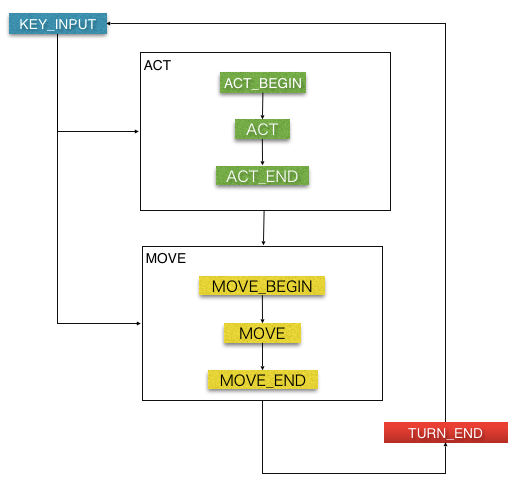

#ローグライクをつくる15のステップ(私的メモ編)

ローグライクをつくる15のステップ

* [http://d.hatena.ne.jp/countable/20120717/1342505647](http://d.hatena.ne.jp/countable/20120717/1342505647)

を自分用に書き出したもの

## Step 1. Decide to write a game (がんばるぞ)

* ローグライクをひたすら遊ぶ
 * トルネコやシレンは、和製ローグライクのフラグシップタイトルなので遊んでおいた方がよいかも
 * Steamで、Roguelike タグがついているゲームをひたすら遊んでみるのもよいかもしれない
 * 色んなローグを遊ぶと、自分の遊びたいローグライクのイメージが固まる
* ローグライクの定義を知る
 * PDLやベルリン解釈を知る
* 他の人のローグライクに対する意見を聞いてみる
 * ローグライクについて書いてあるブログを読んでみる
 * 掲示板のローグライクの論争を読んでみる

## Step 2. Hello world! (環境を整えよう)

* 自分が開発しやすい環境を探す
* 最初は2Dゲームを作れる環境がいいかも……
 * 3Dゲームだと考えることが増えてしまうため

## Step 3. It's a boy! (画面表示とキー入力)
### プレイヤーを画面に表示する
* 素材がなければ矩形でもいい。とりあえずフリー素材を使うのもよい
 * 4方向移動であれば、上下左右に向いている画像を使う。8方向の場合は斜め向きの画像が必要
* 3Dだとモデルを回転させるだけなので、その点は楽になるかもしれない
* 方向の定数や列挙型(例えば上向きであれば、「eDir.Up」など)を用意しておくと何かと便利

### グリッド移動の実装
グリッド（マス目）単位で移動をするゲームであれば、グリッド移動を実装する

* 座標系は、グリッド座標系とスクリーン座標系(スクロールありであれば、さらにワールド座標系)の座標系を用意して、相互に変換できるようにする
* オブジェクトの座標は、基本的にはグリッド座標系で管理した方が都合が良い
 * 攻撃対象の判定やアイテムを拾う衝突判定など、グリッド座標系で処理した方が、処理も高速で位置関係もつかみやすくデバッグがやりやすい

#### 移動座標の計算方法
オブジェクトの移動は移動値を持たせるよりも、補完で計算した方が制御しやすい

* 現在の座標をp1、移動先座標をp2、補完フレーム数をtとすると
* p1 + (p2 - p1) * t で、座標が割り出せる
* tは、0.0〜1.0

### メッセージウィンドウの表示
* テキスト表示処理の実装
* どこのモジュールからでも、メッセージを追加できるようにする
 * メッセージの管理をQueue(FIFO)で実装すると、表示最大数を超えたときに先頭のメッセージを消す、という処理がやりやすくなる

## Step 4. The Map (マップとマップオブジェクト)
### マップのデータ構造
マップは、整数値の配列で管理する。配列へのアクセスはX座標・Y座標を指定してアクセスできるクラスを用意しておくと便利

例えば、Array2Dというクラスを作る

```cpp
// X/Y座標にある値を取得する
int Array2D::Get(int x, int y);

// X/Y座標に値(v)を設定する
int Array2D::Set(int x, int y, int v);
```

領域外にアクセスした場合は、例えば「-1」を返すという作りにしておくと、領域外アクセスエラーを気にする必要がなくなる

### 壁との当たり判定
プレイヤーの移動先に壁があるかどうかチェックして、壁がある場合は移動できないようにする。この判定をするために、移動方向を指定すると移動先の座標を返却すると便利かもしれない

```cpp
/**
 * 2次元の座標クラス
 */
struct Pos2D {
  int x;
  int y;
};

/**
 * 現在の座標(position)と移動したい方向(dir)を渡すと
 * 移動先の座標を取得
 */
Pos2D DirUtil::Move(Pos2D position, eDir dir);
```

### フィールド情報の管理クラスの作成
この時点で、フィールド情報の管理用のクラス(Field)を実装しておくとよいかもしれない。

```cpp
// マップデータの生成
void Field::Create(Array2D mapdata);

// グリッド座標(X)をワールド座標(X)に変換
int Field::ToWorldX(int xgrid);

// グリッド座標(Y)をワールド座標(Y)に変換
int Field::ToWorldY(int ygrid);

// ワールド座標(X)をグリッド座標(X)に変換
int Field::ToGridX(int xworld);

// ワールド座標(Y)をグリッド座標(Y)に変換
int Field::ToGridY(int yworld);

// 指定の座標が壁かどうかをチェック
bool Field::IsCollide(xgrid, ygrid);
```

### マップデータの読み込み
後々にダンジョンを自動生成するにしても、この時点では固定のマップデータ読み込みを実装しておくとよい

* 特定の地形、ギミック(罠)でしか発生しない不具合が再現しやすくなる
* 自動生成を実装するには時間がかかる
 * 生成ロジックはそれなりに複雑
 * ゲームがある程度完成してから実装しても遅くはない

マップエディタは、TiledMapEditorが使いやすく作りやすい。また、データ形式はXMLでロードしやすい

## Step 5. Saving/Loading (保存と読み込み)
この時点では、以下のパラメータを保存する

* プレイヤー情報
 * プレイヤーの座標(グリッド座標)
 * プレイヤーの向き
* マップデータ(壁)

この時点では、これだけなので難しくないはず。

### 保存データの形式
保存するデータの形式はJSONが扱いやすい。簡単にシリアライズできること前提だけれども。保存するデータのみのオブジェクトを定義し、それに値を代入しJSON形式にシリアライズすると楽

保存先はテキストファイルにして、可視化できるとデバッグしやすい。特にJSONであれば、「Online JSON Viewer」などJSONを可視化するツールを使うことで視覚的にパラメータを確認しやすく、後々パラメータがたくさん増えたときに、おかしなパラメータが入っていないかどうか簡単にチェックできる

### 保存・読み込み処理のルール
保存・読み込み処理は、保存する（ゲーム状態の復元に必要な）パラメータが追加されたら、すぐにそれを保存・読み込めるように実装すること。これを怠って後でまとめて実装しようとすると、複雑になって実装が難しくなる

また、保存・読み込みの機能を常に有効にしておくと、何か問題が起きたときの再現・テスト・動作確認が、素早く簡単にできるようになる

あと、この処理をショートカットキーとして割り当てておく。保存を「Sキー」、読み込みを「Lキー」にデバッグ用として割り当てておけば、トライ＆エラーが素早くできるようになる

## Step 6. It's alice! Alive! (モンスターとターン制)
おそらくここが最初の難関。ターン制の実装はかなり複雑になる。ちなみに「Risk of Rain」のようなリアルタイムのローグライクを作るのであれば、この面倒な処理は当然ながら実装不要となる

### モンスター
モンスターの処理はプレイヤーと共通する部分が多い。そのため、プレイヤーの処理からモンスターにも流用できそうな部分は切り離して、基底クラスを作る。モンスターはその基底クラスを継承する


現時点では、座標や方向、グリッド単位での移動処理は共通で使うことになるので、このあたりを切り出す

### ターン制
ターン制でまず気をつけるべきことは、更新タイミング。
もしゲームエンジンを使っているならば、ゲームエンジンに用意されているいつ呼び出されるか分からない更新関数は使ってはいけない

例えば、Unityであれば、MonoBehaviour#Updateで行動処理を行わないようにする

理由は、更新の順番をこちらで制御して、更新タイミングの同期を取ることが難しくなるから

Actorクラスに新たに別の更新関数を用意する。例えばProcという名前の更新関数を用意して、行動処理はここで行うようにする

#### Actorに必要な行動状態
基本的なターン制を実装するために、以下の状態定数(enum)を定義する

```cpp
/**
 * 行動状態
 */
enum eAct {
  KeyInput, // キー入力待ち。もしくは待機中
  
  // アクション
  ActBegin, // 開始
  Act,      // 実行中
  ActEnd,   // 終了
  // 移動
  MoveBegin, // 開始
  Move,      // 移動中
  MoveEnd,   // 完了
  
  TurnEnd,   // ターン終了
};
```

ここでのアクションとは、攻撃行動やアイテムを使ったりする動作を表す。移動は文字通り移動処理を行う。



ゲーム開始時には、 *KEY_INPUT* 状態となり入力を受け付けたり、プレイヤーが行動するまで待機する。
近くに敵がいて、それに対して攻撃する場合は *ACT_BEGIN* に遷移し、移動するのであれば *MOVE_BEGIN* に遷移する。
すぐには行動せずに、自分の行動順が回ってきたタイミングで、それぞれの行動を行う。
行動が終わったら *TURN_END* となり、全員が *TURN_END* になったらターン終了。全員を *KEY_INPUT* に戻す。

### シーケンス管理
各Actorの更新処理の呼び出しは、シーケンス管理クラスから行う。


トルネコ・シレン準拠の制御をすると基本のシーケンスはこのようになる。
*KEY_INPUT* ではプレイヤーの行動を監視し、移動以外の行動を行う場合は、プレイヤーの行動を実行する。
その後、敵の行動判定を行うが、プレイヤーが「移動」を選んだか、「行動」(攻撃など)を選んだかで処理順番が変わる。

* プレイヤーが移動 → 敵も一緒に動かすため移動を先に処理する
* プレイヤーが行動 → 敵を移動させてから行動処理をする

複数の敵が存在する場合は、処理の順番を間違えないようにシーケンスを制御しないとおかしなことになる。

無事、全員の移動・行動が完了すればターン終了となり、*KEY_INPUT*へ戻る

これら、シーケンスの制御は非常に複雑なので、手書きでもよいので一度シーケンスの流れを図にして、状況を整理しながら実装した方が結果的に無理なく実装できるはず

後々に、インベントリを実装したり、アイテムを投げたり、杖を使ったりする処理を実装すると、さらにシーケンスが複雑になる。
なので、その場合も図を見ながら整理できるように、図は残しておいた方がよい

## Step 7. Interaction (戦闘システム)

### キャラクターのステータスパラメータ
キャラクターのステータスパラメータを実装する。
ステータスパラメータは、別のデータ構造として定義しておく

```cpp
/**
 * キャラクターパラメータ
 */
class Params {
  int id;    // ユニークID
  int lv;    // レベル
  int hp;    // HP
  int hpmax; // 最大HP
  int str;   // 力
  int exp;   // 獲得した経験値
  int xp;    // 倒したときに得られる経験値
};
```

Actorとは別のデータオブジェクトとすることで、外部からこのパラメータを渡すことで、ステータスパラメータを設定することができるようになる

IDは、プレイヤーを「0」、敵は「1」から開始、とするとIDでプレイヤーか敵かどうかを判定できる。
それが嫌な場合はキャラクター種別のパラメータを用意しておく。

なお、ステータスパラメータが実装できたら、保存・読み込みができるようにしておく

### 敵の移動AIの実装
敵のAIは、この時点では単純で頭の悪いAIで構わない。例えば以下のように移動方向を決定する

```cpp
// プレイヤーへの距離を求める
int dx = player.x - enemy.x;
int dy = palyer.y - enemy.y;

if(Math.abs(dx) > Math.abs(dy)) {
  // X方向への距離の方が遠いのでそっちに進む
  if(dx < 0) { return eDir.Left;  } // 左
  else       { return eDir.Right; } // 右
}
else {
  // Y方向へ進む
  if(dy < 0) { return eDir.Up;   } // 上
  else       { return eDir.Down; } // 下
}
```

ひとまず敵を動かすのであれば、これで充分。
しかし最終的には、A*など精度の高いAIアルゴリズムの実装が必要。

理由は、このAIでは敵は壁に引っかかってしまい、自然回復による体力回復などが安全にできてしまうなど、ゲームデザイン的に致命的な問題となりやすいため

## Step 8. Data files (データファイル)
